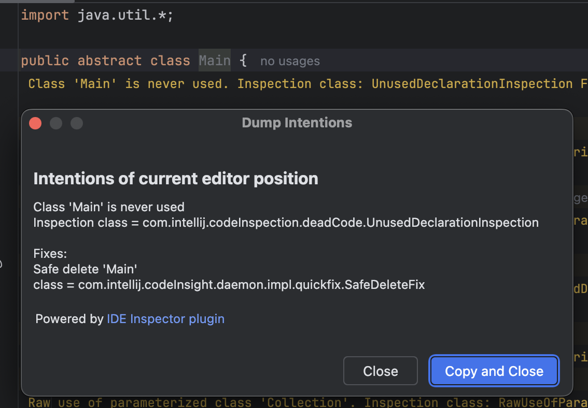

# IntelliJ IDEInspector

Quickly find intention/inspection classes in the IDE.

1. Install the plugin in IDEA and open the IDEA Community project
2. Install the plugin in the same IDEA or another IDE e.g., WebStorm(does not support Rider)
3. Open any project and click the inspection result string. Also, on any line in the editor, you can try the `Help | Dump Editor Intentions menu.` to display all intention action's class list.
4. Copy classes name.
5. In the IDEA repo, use the menu `Help | Show Git Log For Classes...`, the corresponding class file and the Git Log will be shown

Tip: In the Git tool window, right-click the **History** tab and select `Split 'History' Group`

Inspired by [Inspection Lens](https://plugins.jetbrains.com/plugin/17302-inlineerror) for IntelliJ Platform.

> By default, the plugin shows **Errors**, **Warnings**, **Weak Warnings**, **Server Problems**, **Grammar Errors**, **Typos**, and other inspections with a high enough severity level. Configure visible severities in **Settings | Tools | Inspection Lens**.

